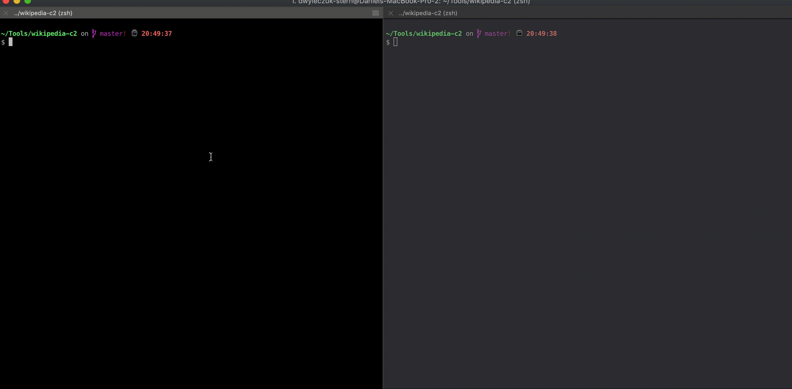

# Wikipedia-C2

This is a demo project to demonstrate Command and Control utilizing Wikipedia. After [Josh Abraham's](https://twitter.com/Jabra) demo of C2 utilizing Slack and ICMP, I thought I'd explore what other options in the internet's top sites could be used for C2. After reviewing [Wikipedia's API](https://en.wikipedia.org/w/api.php), I saw that there was a user option for [user-jsarbitraryKeyName](https://www.mediawiki.org/wiki/API:Options) that could be an "arbitrary value". I later found that it was a max length of 65535 characters, which is more than enough for C2.

## Getting Started

This project requires Python 3. It works on both Windows and macOS and Linux (though I only tested on the first 2). You'll need the requests library.

### Prerequisites

```
pip install -r requirements.txt
```

## Executing



## Authors

* **Daniel Wyleczuk-Stern** - [dweezy-netsec.github.io](https://dweezy-netsec.github.io/)

## License

This project is licensed under the MIT License - see the [LICENSE.md](LICENSE.md) file for details

## Acknowledgments

* Josh for his inspiration to look at other sites that could be used for stealthy C2.

## Disclaimer

This is for demo purposes only. Do not use this for unauthorized access. Any use of this tool should be for testing purposes with full permissions from the owners of the system. I have also not read through Wikipedia's acceptable use policy, so please do before utilizing this tool in an operational environment.
